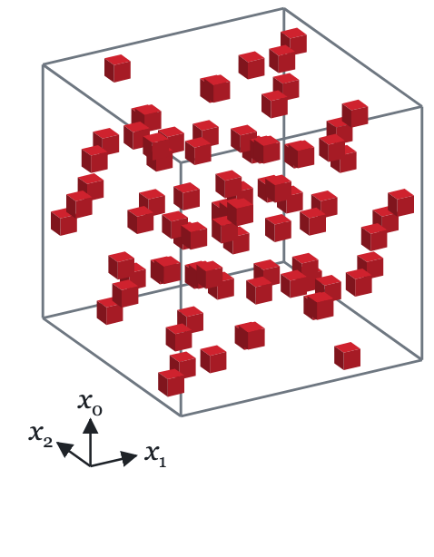
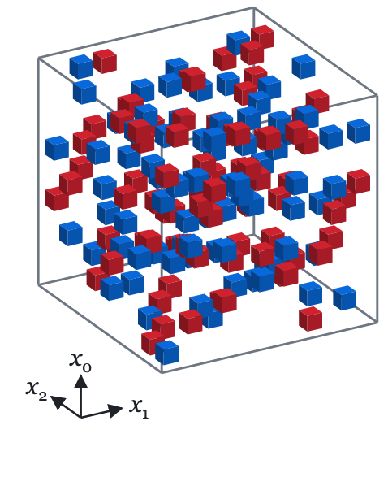
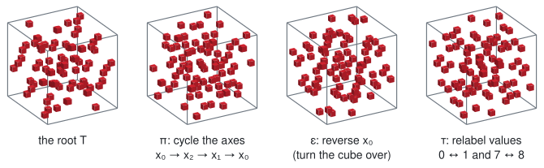
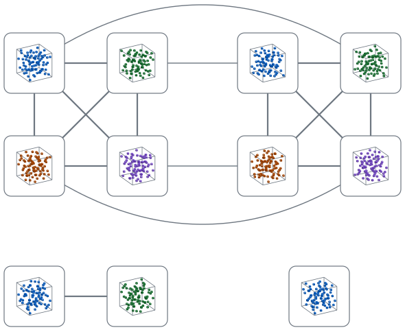
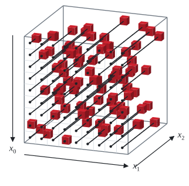
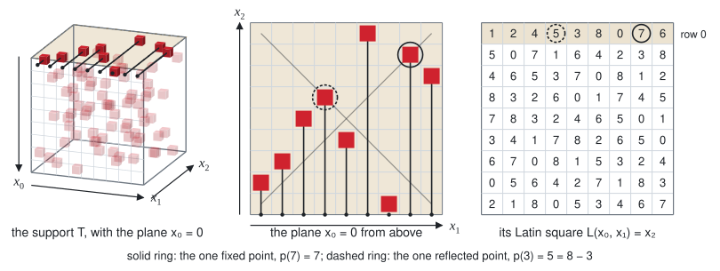

# There is no fully diagonalized Latin cube of order 9

This repository aims to cleanly demonstrate a negative answer to a question which was (to my knowledge) first posed by Walter Taylor in a 1972 paper.

A d-dimensional **fully diagonalized Latin hypercube** (FDLH) (called *completely Latin* by Arkin, Hoggatt and Straus) is a coloring $A : [n]^d \to [n]$, where $[n] = \lbrace0, 1, \ldots, n-1\rbrace$, in which each color occurs exactly once on every *line*.  A line is a subset of $[n]^d$ which can be obtained by letting $t$ run over $[n]$ and taking each coordinate to be a constant, $t$, or $n-1-t$, with at least one coordinate varying.  In dimension 3 the lines are the rows, the columns and the pillars, the diagonals of every planar cross-section of the cube, and the four space diagonals; each must therefore contain every color.

Every pair of the $2^d$ corner cells lies on a line, which forces $n \le 1$ or $n \ge 2^d$ (Taylor's Proposition 4).  Taylor writes $P(m, n)$ for the existence of such an $n$-dimensional cube of order $m$, and his Problem 3 asks two questions: "For every $n$ does there exist $M$ such that $P(m, n)$ whenever $m \ge M$?  May one take $M = 2^n$?"  His Problem 2 asks in particular about order 9 in dimension 3.


(His Problem 1, the 12x12 square, was settled almost immediately: Hilton (1973) and, independently, Faber constructed doubly diagonalized Latin squares of every order at least 4, as Taylor notes in proof, and Gergely (1974) gave a simpler construction.)


While there is a fully diagonalized Latin cube of order 8 (as shown by Taylor), **there is none of order 9.**  This answers Problem 2 negatively and rules out $M = 2^d$ at $d = 3$; it leaves open the first question of Problem 3, whether *some* $M$ exists in each dimension.  The method does not extend to order 10: the catalogue of candidate color classes would be thousands of times larger (a pilot suggests at least 6 x 10^10 entries and a core-year of enumeration), and the case analysis here relies on the cube having a center cell, which an even cube does not (though the order 8 case is sufficiently small to use as a sanity check anyways).  Settling order 10 seems to need a new idea, though if an order-10 cube exists a search might of course find it long before exhausting anything.


Our proof centers around *supports*, sets $T \subseteq [9]^3$ which contain precisely one cell per line. Supports are potential places a particular color could occur in a cube: if we colored every cell in a given support red, then the cube would have precisely one red cell in each line. Two supports are compatible if they are *disjoint*, or share no elements in common. If we color one support red and another support blue, then if they share a cell there will be some cell we tried to give two different colors — but if they don't share any cells, then we would have an incomplete cube with precisely one red cell and one blue cell in each line.

<p align="center">
<picture><source media="(prefers-color-scheme: dark)" srcset="figures/support-dark.gif"></picture>
<picture><source media="(prefers-color-scheme: dark)" srcset="figures/two-supports-dark.gif"></picture>
</p>

Left: a support of $[9]^3$, 81 cells with exactly one on each of the 301 lines.  It contains the center cell $(4, 4, 4)$, which makes it a *root* (see the outline below); it is the representative of the exceptional orbit described in Part I.  Right: the same support with a blue one disjoint from it, so that every line holds exactly one red cell and one blue cell.

The basic idea of the proof is to show that it is impossible to pick nine supports which are all disjoint. This is conceptually straightforward — the difficult part is choosing and verifying the correctness of an algorithm which rules out possible sets of supports efficiently enough to exhaust the possibilities in a reasonable amount of time.


The rough outline of our algorithm is as follows:
1. Enumerate every support. This part is relatively straightforward — there end up being only $14\,616\,576$, so the hard part is working through all the possible sets of several supports. Call a support containing the center cell a *root*.
2. Pick a symmetry group $G$ that acts on $[9]^3$ and maps supports to supports and roots to roots (and therefore FDLHs to FDLHs).
3. Use $G$ to divide the supports into symmetry classes. Some of these symmetry classes will contain only roots, and the others will contain only non-roots. From each symmetry class containing roots, pick one representative root $T$.
4. Form the graph $\Gamma(T)$ consisting of all the supports disjoint with $T$. Connect two supports with an edge iff they are disjoint.
5. Show for each such $\Gamma(T)$ that it contains no 8-cliques (groups of 8 vertices where every vertex is connected to every other vertex).

<p align="center"><picture><source media="(prefers-color-scheme: dark)" srcset="figures/orbit-dark.svg"></picture></p>

The root above and three other members of its symmetry class, each its image under one simple element of $G$: one that cycles the axes, one that reverses the axis $x_0$, and one that relabels the values $0, \ldots, 8$ on every axis at once, in a way that keeps each pair $\lbrace t, 8 - t\rbrace$ together.  All four contain the center cell.  This root's class has 384 members.

<p align="center"><picture><source media="(prefers-color-scheme: dark)" srcset="figures/companion-graph-dark.svg"></picture></p>

Part of $\Gamma(T)$ for the same root: supports disjoint from it, joined when they are disjoint from each other, and colored so that no two disjoint supports share a color.  The top two rows are the component containing both of the graph's 4-cliques, the two squares with their diagonals; each clique is four pairwise disjoint supports, which together with the red root fill five colors of a cube.  A full cube would need an 8-clique.  The top-left blue support is the one in the figure above.  Below them are two smaller components: a single edge, one of 144 in this graph, and a vertex with no edges, one of 960 among its 1 504 vertices.

An order 9 fully diagonalized Latin cube, if one existed, would have a root $T = A^{-1}(A(4,4,4))$ containing its center cell, and could be transformed with a symmetry from $G$ into a fully diagonalized Latin cube $A'$ whose root $T'$ is whichever root we chose from the symmetry class containing $T$. The other eight supports $A^{-1}(\text{color})$ would then necessarily (i) each be disjoint with $T$ and (ii) all be pairwise disjoint, implying the existence of an 8-clique in the graph $\Gamma(T)$. Because our enumeration shows no such 8-cliques exist, there cannot exist a fully diagonalized Latin cube of order 9.


Part I gives the mathematics behind each step, carefully checking each step of the argument that testing one root per symmetry class is enough.  Part II describes the computation:

* **The support catalogue** — the file of all $14\,616\,576$ supports, its
  byte format and canonical order, and where to download it.
* **What each step does** — a table of every step of the pipeline, with its
  program, input and expected output, and which steps each mode runs.
* **The artifacts and their checksums** — the SHA-256 of every file the
  pipeline produces.
* **The order-8 controls** — the test suite, which runs the whole pipeline at
  order 8, where a cube exists and the answers are known, and checks that
  every failure path actually fails.
* **How long it takes**, **Memory and disk** — measured running times and
  resource use on two machines.
* **Reproducing it** — options, resuming an interrupted run, and requirements.

Start with `make` and `./verify.sh test`, then pick a mode according to how
much you want to recompute:

```
make                      # six C programs, no libraries
./verify.sh test          # the order-8 controls          (12-97 s)
./verify.sh full          # everything, from nothing    (2 h 41 m on 14 cores)
./verify.sh symmetric     # the same, one shard per symmetry orbit (9-24 min)
./verify.sh fast --catalogue n9_supports.bin   # everything downstream of the
                                               # catalogue     (7-13 minutes)
```

* `full` recomputes the catalogue from nothing and relies on no mathematics
  beyond the clique bound (Lemmata 1–4).
* `symmetric` recomputes it too, but enumerates only 157 of the 48,912 shards
  (sets of supports sharing the same first face) and obtains the rest by
  symmetry — three hundred times less search, at the cost of also relying on
  the shard symmetry (Lemma 5).
* `fast` takes the catalogue as given, verifies its SHA-256 before reading it,
  and redoes everything downstream.

You need a 64-bit POSIX platform with GCC or Clang, GNU make, `bash`, and
Python 3.8+ with numpy (details under *Reproducing it*).  The pool re-derivation
is the one memory-hungry stage: on an 8 GB machine pass `--pool-workers 1`.

A failed check aborts the run, so reaching the final `done --` line means every
step passed, the last of them comparing all seven SHA-256s against
`checksums.txt`.  The result is `work/n9_root_results.jsonl`, one line per root
orbit; all 2 049 lines have `status` `EXHAUSTED` and `covers` `0`.

---

## Part I. The mathematics

Throughout, $n$ is the order ($9$ in every concrete example, $8$ in the
controls), $r(t) = n-1-t$ is reversal, and a cell of $[n]^3$ is written
$x = (x_0, x_1, x_2)$ and stored (in C) at index $(x_0 \cdot n + x_1) \cdot n + x_2$,
which at $n = 9$ is $81 x_0 + 9 x_1 + x_2$.  The source code and its comments
write the same three coordinates as `i`, `j`, `k`.

### Lemma 1 (supports and partitions)

Call a set of cells meeting every line exactly once a **support**, and write
$T(n)$ for the set of supports of $[n]^3$.

> Let $A \colon [n]^3 \to [n]$.  (a) $A$ is an FDLH iff every color class
> $A^{-1}(\text{color})$, $\text{color} \in [n]$, is a support.  (b) Every support has exactly $n^2$
> cells.  (c) An FDLH of order $n$ exists iff there is a subset of $T(n)$ containing $n$ pairwise
> disjoint members: any $n$ pairwise disjoint supports partition $[n]^3$, and
> giving them distinct colors yields an FDLH.

*Proof.*  (a) A line has $n$ cells, so it carries all $n$ colors exactly when
it carries each of them once, that is, when it meets every color class once.
(b) The $n^2$ pillars $\lbrace(x_0,x_1,\ast)\rbrace$ are lines (only the third
coordinate varies), they are pairwise disjoint and they cover the cube, and a
support meets each of them once.  (c) By (b), $n$ pairwise disjoint supports
occupy $n \cdot n^2 = n^3$ cells and so partition $[n]^3$; give each a different
color and (a) says the result is an FDLH.  Conversely, by (a) the color classes
of an FDLH are $n$ pairwise disjoint supports. ∎

**Listing and counting lines.**  Replacing $t$ by $r(t)$ throughout traces
the same line in the opposite direction, so to list each line once, require its
first varying coordinate to use the pattern $t$.  In dimension $d$, choose the
$s$ varying coordinates, the direction ($`t`$ or $`r(t)`$) of each varying
coordinate after the first, and the fixed values of the $d-s$ others:

$$\sum_{s=1}^{d} \binom{d}{s}\, 2^{s-1}\, n^{d-s},$$

which for $d = 3$ is $3n^2 + 6n + 4$: **301** at $n = 9$ (243 axis lines, 54
plane diagonals, 4 space diagonals), 244 at $n = 8$.

### Lemma 2 (Latin-square form, and what row 0 must be)

> Every support $T$ of $[n]^3$ is $\lbrace(x_0, x_1, L(x_0,x_1)) : x_0, x_1 \in [n]\rbrace$
> for a unique Latin square $L \colon [n]^2 \to [n]$, and the row $p = L(0, \cdot)$
> is a permutation of $[n]$ with exactly one fixed point and exactly one
> reflected point (exactly one solution each of $p(t) = t$ and $`p(t) = r(t)`$).
> Consequently $T(n)$ is the disjoint union of the shards $S_p$ over the
> admissible permutations $p$.

<p align="center"><picture><source media="(prefers-color-scheme: dark)" srcset="figures/latin-depth-dark.svg"></picture></p>

The root from the figures above, drawn with $x_0$ running down and $x_1$ across, like the rows and columns of a matrix, and $x_2$ running away from the viewer.  Each pillar $\lbrace(x_0, x_1, \ast)\rbrace$ holds exactly one red cell, so the support is a $9 \times 9$ array of depths: the number written on the front face at $(x_0, x_1)$ is $L(x_0, x_1)$, and the segment from it to the red cell crosses exactly that many cells.  The same numbers, read as a grid, are the Latin square on the right.

Supports have the form $\lbrace(x_0, x_1, L(x_0,x_1)) : x_0, x_1 \in [n]\rbrace$ merely due to the requirement that the support contain one cell from each *axis* line — that part of the statement would be true even for supports of merely Latin cubes (i.e. the more general notion of support that permits choosing zero or multiple cells from a diagonal).  The fixed point comes from the requirement that the support hit the positive diagonal of the plane $x_0 = 0$, while the reflected point comes from the requirement to hit the negative diagonal.

<p align="center"><picture><source media="(prefers-color-scheme: dark)" srcset="figures/latin-square-dark.svg"></picture></p>

Left: the cells with $x_0 = 0$, in the shaded top plane.  Middle: that plane seen from above, with its two diagonals.  Each segment crosses as many cells as the matching entry in row 0 of the Latin square on the right, and the support meets each diagonal exactly once, at the fixed point and at the reflected point of $p$.  Right: the Latin square, whose row 0 is the permutation $p$.

*Proof.*  The pillar $\lbrace(x_0,x_1,\ast)\rbrace$ is a line (third coordinate $t$, the other
two constant), and $T$ meets it exactly once, which picks out the single value
$L(x_0,x_1)$.  Meeting each of the lines $\lbrace(x_0,\ast,x_2)\rbrace$ and $\lbrace(\ast,x_1,x_2)\rbrace$ exactly
once says that every row ($x_0$ fixed) and every column ($x_1$ fixed) of $L$ contains every value once, so
$L$ is a Latin square and its first row $p$ is a permutation.  Finally the plane $x_0 = 0$
contains the two lines $\lbrace(0,t,t)\rbrace$ and $\lbrace(0,t,r(t))\rbrace$ — first coordinate
constant at $0$, the other two varying — and meeting each exactly once gives
the two conditions on $p$. ∎

Call a permutation with one fixed point and one reflected point **admissible**.  A **shard** is the set of all supports whose Latin squares $L$ have one specified first row, or equivalently the set of all supports that share one specified $x_0 = 0$ plane. Since every support's first row is admissible (Lemma 2), an exhaustive enumeration need only consider the shards corresponding to every admissible row (some of which may turn out to be empty).


The numbers of admissible permutations are [OEIS A007016](https://oeis.org/A007016): $8, 20, 96, 656, 5568, 48912$ for $n = 4..9$.  This repository computes the order-9 count in two different ways, by brute force over all $9! = 362\,880$ permutations (`shards.c`) and by inclusion–exclusion in closed form (`check.py a007016 N`), and both agree with OEIS.

Within each shard the enumerator solves an exact-cover problem: the 301 lines
must each be covered exactly once, and choosing a cell covers the lines through
it.  The shard's row fixes the support's nine cells in the plane $x_0 = 0$, so
the search places the other 72.  It is [Knuth's Algorithm X with dancing links](https://en.wikipedia.org/wiki/Knuth's_Algorithm_X).

### Roots

When $n$ is odd, $[n]^3$ has a center cell $c_0 = (m,m,m)$ with $m = (n-1)/2$
— $(4,4,4)$ at $n = 9$ — and exactly one color class of an FDLH of order $n$
contains it, because the color classes partition the cube.  Call a support
containing $c_0$ a **root**.  To rule out an FDLH of odd order $n$ it therefore
suffices to show that no root belongs to a partition of $[n]^3$ into $n$
supports.  (An even cube has no center cell and no roots; the order-8 control
runs its root search on every support instead, see below.)

An aside, not needed for the proof: all four space diagonals pass through $c_0$. A root meets all four with that one cell, while a support avoiding the center must meet them at four distinct cells.  That may be why roots are more common than one might naively expect — $11\,821\,056$ of the $14\,616\,576$ supports, 80.9 %, contain the center.

### Lemma 3 (orbit reduction)

We need to test only one root from each symmetry class, for some suitable notion of symmetry classes. For example, if two roots are reflections of each other, ruling out that one of them occurs in an FDLH also implies that the other does not. To maximize the efficiency of our exhaustive enumeration, we wish to use the largest valid choice of symmetry group we can, i.e. the group which maximizes the size of each root's symmetry class while still ensuring that checking one representative from each class is sufficient.

The symmetries used here include permutations of the axes and reversals of individual axes. It should be intuitively clear that those both preserve all the properties we need: they just amount to choosing a different set of axes to use for describing your cube, and all the diagonals are still diagonals regardless of what set of axes you choose. 

Reversing an axis is one example of a more general move: relabeling the *values* along each axis.  Pick permutations $\sigma = (\sigma_0, \sigma_1, \sigma_2)$ of $\lbrace 0, \ldots, 8\rbrace$ for each coordinate $i$, and replace the $i$-th coordinate $x_i$ of every cell by $\sigma_i(x_i)$, i.e. $\sigma(x_0, x_1, x_2)$ = $(\sigma_0(x_0), \sigma_1(x_1), \sigma_2(x_2))$.  Reversing axis $i$ is the relabeling $\sigma_i = r$, $t \mapsto 8 - t$, with the other two left alone.

Axis lines survive any relabeling, but diagonals do not.  Call $u$ and $8 - u$ **partners**.  Along a diagonal, the two varying coordinates are either always partners, as in $(t, 8 - t, 3)$, or always equal, as in $(t, t, 3)$. After we apply $\sigma = (\sigma_1, \sigma_2, \sigma_3)$, we will still want diagonals to fall on diagonals, so they will have to still be one of those two options. This takes two conditions:

**(a): Each $\sigma_i$ sends partners to partners**: whenever $\sigma_i(u) = v$, also $\sigma_i(8 - u) = 8 - v$.  (Swap just $0$ and $1$ in the first coordinate, and the cells $(0,8,3), (1,7,3), \ldots$ become $(1,8,3), (0,7,3), \ldots$; since $1$ and $8$ are not partners, these lie on no line.)  It helps to fold the values in half at $4$:

| distance from 4 | 0 | 1 | 2 | 3 | 4 |
|---|:-:|:-:|:-:|:-:|:-:|
| values | 4 | 3, 5 | 2, 6 | 1, 7 | 0, 8 |

$4$ is its own partner, so a partner-respecting $\sigma_i$ must fix it.  Every other value belongs to one of the four pairs, and $\sigma_i$ carries each pair onto a pair.  So choosing $\sigma_i$ means two independent choices:

1. where each pair goes: any rearrangement of the four pairs, $4! = 24$ ways;
2. for each pair, which of its two values goes to which value of its new pair: $2^4 = 16$ ways.

That makes $24 \cdot 16 = 384$ partner-respecting permutations.  For example, the relabeling in the figure above swaps the pairs $\lbrace 0, 8\rbrace$ and $\lbrace 1, 7\rbrace$, sending $0 \to 1$ and $8 \to 7$ and back; the one that leaves every pair in place and flips only $\lbrace 3, 5\rbrace$ swaps $3$ and $5$ and fixes everything else; and leaving every pair in place but flipping all four is $r$ itself.  In symbols, "partners go to partners" is $\sigma_i(r(t)) = r(\sigma_i(t))$ for every $t$: $\sigma_i$ of $t$'s partner is the partner of $\sigma_i(t)$.  The permutations satisfying it are the ones that commute with $r$, known as the centralizer $C(r)$ or $r$.

**(b): The three $\sigma_i$ agree up to $r$**: for each $i, j$, either $\sigma_i = \sigma_j$ or $\sigma_i = r \sigma_j (= \sigma_j r)$. Equivalently, we can fix $\sigma_0$ and then say that $\sigma_1$ and $\sigma_2$ are each either $\sigma_0$ or $r \sigma_0$.  Partner-respecting relabelings chosen independently are not enough, so we need this additional condition.  For example, swap $3$ and $5$ in the second coordinate only, and $(t, t, 3)$ becomes $(3, 5, 3)$ at $t = 3$ but $(0, 0, 3)$ at $t = 0$: its first two coordinates are neither always equal nor always partners.

So a symmetry permutes the axes by some $\pi$ and then relabels coordinate $i$ by $\sigma_i$, subject to those two conditions.  Reversing $x_0$ is $\sigma = (r, \mathrm{id}, \mathrm{id})$, and relabeling every axis the same way is $\sigma_0 = \sigma_1 = \sigma_2$.

More precisely:

> Let $C(r)$ be the centralizer of $r$ in the symmetric group $S_n$ on $[n]$:
> the permutations $\sigma$ of the coordinate values with $\sigma(r(t)) = r(\sigma(t))$
> for all $t$.  For $\pi \in S_3$ and $\sigma \in C(r)^3$ with
> $\sigma_1, \sigma_2 \in \lbrace \sigma_0, \sigma_0 \circ r \rbrace$, define
> $g = g(\pi; \sigma_0, \sigma_1, \sigma_2) \colon [n]^3 \to [n]^3$ by
>
> $$g(x)_i = \sigma_i\bigl( x_{\pi(i)} \bigr).$$
>
> These maps form a group $G$ of permutations of $[n]^3$, of order
> $6 \cdot 4 \cdot \lvert C(r) \rvert$ when $n \ge 2$ ($9216$ at $n = 8$ and $n = 9$),
> and every $g \in G$ (i) maps lines to lines, hence supports to supports;
> (ii) fixes the center cell $c_0$ when $n$ is odd; (iii) maps partitions of
> $[n]^3$ into supports to partitions.  Consequently, for odd $n$, a root $T$
> lies in a partition iff $gT$ does, for every $g \in G$, so it suffices to
> test one root per $G$-orbit.

Throughout the proof, write $\sigma_i = \sigma_0 \circ \varepsilon_i$ with $\varepsilon_0 = \mathrm{id}$ and $\varepsilon_1, \varepsilon_2 \in \lbrace \mathrm{id}, r\rbrace$.

*Proof.*  (i)  Consider a line in $[n]^3$. We can write any such line as the image of a function $\ell = (\ell_0, \ell_1, \ell_2): [n] \to [n]^3$. It is natural to think of a line as moving between adjacent cells as the index variable $t$ increases, so that $\ell(t)$ and $\ell(t+1)$ are orthogonally or diagonally adjacent cells, but in fact $\ell$ can pick out the cells in the line in a totally arbitrary order: formally, for a permutation $\sigma_i \in S_n$, we have $\sigma_i([n]) = [n]$, and so $(\ell \circ \sigma_i)([n]) = \ell([n])$.

For a given $g \in G$, we wish to show that (the image of) $(g \circ \ell)$ is a line. We can divide $\ell$ into *fixed coordinates*, where $\ell_i$ is a constant function, and *varying coordinates*, where $\ell_i$ is some permutation of $[n]$. For functions $f, h \colon [n] \to [n]$, write $f \sim h$, and say that $f$ and $h$ agree up to $r$, when $f = h$ or $f = r \circ h$.  This is an equivalence relation: its classes are the cosets $\lbrace h, r \circ h\rbrace$ of the subgroup $\lbrace \mathrm{id}, r\rbrace$.  It is also preserved by composing on the left with any $\sigma \in C(r)$: if $f = r \circ h$, then $\sigma \circ f = \sigma \circ r \circ h = r \circ \sigma \circ h$, because $\sigma$ commutes with $r$.

It is "obviously" the case that $\ell$ is a line if and only if $\ell$ is nonconstant and all the varying coordinates $\ell_i$ agree up to $r$.

Because $g$ is a bijection, it maps a nonconstant function to a nonconstant function. And for any two varying coordinates $(g \circ \ell)_i$ and $(g \circ \ell)_j$, we have

$$\begin{aligned}
(g \circ \ell)_i &= \sigma_i \ell_{\pi(i)} \\
&\sim \sigma_j \ell_{\pi(i)} \\
&\sim \sigma_j \ell_{\pi(j)} \\
&= (g \circ \ell)_j.
\end{aligned}$$

The second step holds because $\sigma_i \sim \sigma_j$.  The third step follows because, since $`(g \circ \ell)_i`$ and $`(g \circ \ell)_j`$ are nonconstant, $`\ell_{\pi(i)}`$ and $`\ell_{\pi(j)}`$ must also be nonconstant. Thus $`\ell_{\pi(i)} \sim \ell_{\pi(j)}`$ (since $\ell$ is a line); composing on the left with $\sigma_j$ preserves that.

A bijection of cells that permutes the lines carries a set meeting every
line once to a set meeting every line once, so $G$ maps $T(n)$ to $T(n)$.

(ii)  For odd $n$, $r$ has the unique fixed point $m = (n-1)/2$, and
$\sigma r = r \sigma$ forces each $\sigma \in C(r)$ to permute the fixed points of $r$, so
$\sigma_i(m) = m$; and $\pi$ merely permutes the equal coordinates of $(m,m,m)$.  So
$g(c_0) = c_0$ for every $g \in G$.  (For even $n$ there is no fixed point and
no center; (i) and (iii) are unaffected.)

(iii)  $g$ is a bijection of the cell set, so $T_1, \ldots, T_n$ are pairwise
disjoint supports covering the cube iff $gT_1, \ldots, gT_n$ are.

It remains to show that these maps form a group, and to count them.

*Closure.*  Let $g = g(\pi; \sigma_0, \sigma_1, \sigma_2)$ and $`h = g(\rho; \sigma'_0, \sigma'_1, \sigma'_2)`$.  Then, applying $h$ first,

$$(g \circ h)(x)_i = \sigma_i\bigl(h(x)_{\pi(i)}\bigr) = \sigma_i\bigl(\sigma'_{\pi(i)}\bigl(x_{\rho(\pi(i))}\bigr)\bigr),$$

so $g \circ h$ has coordinate permutation $\rho \circ \pi$ and relabelings
$`\sigma''_i = \sigma_i \circ \sigma'_{\pi(i)}`$.  Each $`\sigma''_i`$ is in $C(r)$, and they still agree up
to $r$: writing $\sigma_i = \sigma_0 \varepsilon_i$ and $`\sigma'_j = \sigma'_0 \varepsilon'_j`$, and moving the
reversals past $`\sigma'_0`$ (they commute with it),
$`\sigma''_i = \sigma_0 \sigma'_0 \, \varepsilon_i \varepsilon'_{\pi(i)}`$, where each $`\varepsilon_i \varepsilon'_{\pi(i)}`$ is $\mathrm{id}$ or $r$.  So
every $`\sigma''_i`$ is $`\sigma''_0`$ or $`\sigma''_0 \circ r`$, and $g \circ h$ is again in $G$.  The identity
is $g(\mathrm{id}; \mathrm{id}, \mathrm{id}, \mathrm{id})$, and a finite composition-closed family of
bijections of a finite set contains inverses.  So $G$ is a group.

*The count.*  For $n \ge 2$ a map $g$ determines its parameters: output
coordinate $i$ depends on input coordinate $\pi(i)$ alone, which fixes $\pi$, and
it is $\sigma_i$ of that input, which fixes $\sigma_i$.  So distinct parameters give
distinct maps, and there are $6$ choices of $\pi$, $\lvert C(r)\rvert$ of $\sigma_0$, and
$2$ each of $\sigma_1$ and $\sigma_2$: $\lvert G\rvert = 6 \cdot 4 \cdot \lvert C(r)\rvert$.

If $\sigma$ commutes with $r$ and $\sigma(t) = s$, then $\sigma(r(t)) = r(s)$, so $\sigma$ carries
the pair $\lbrace t, r(t)\rbrace$ onto the pair $\lbrace s, r(s)\rbrace$.  So, as described before
the lemma, $\sigma$ rearranges the $\lfloor n/2 \rfloor$ pairs, flips any of them, and
fixes the middle value when $n$ is odd; conversely every such rearrangement
commutes with $r$.  Hence $\lvert C(r)\rvert = 2^{\lfloor n/2\rfloor} \cdot \lfloor n/2\rfloor!$ — $384$
at $n = 8$ and $n = 9$, so $\lvert G\rvert = 9216$.  The program `orbits` builds all
$6 \cdot 4 \cdot 384 = 9216$ maps, checks that no two coincide, that all of them fix
$c_0$, and that six explicitly named generators generate all of them. ∎

### Lemma 4 (the clique bound)

> Let $T$ be a support of $[n]^3$, let $P(T)$ be the set of supports disjoint
> from $T$, and let $\Gamma(T)$ be the graph on $P(T)$ joining two supports when
> they are disjoint.  Then $T$ lies in a partition of $[n]^3$ into supports iff
> $\Gamma(T)$ contains a clique of size $n - 1$.  In particular, if its clique
> number $\omega(\Gamma(T))$ (the size of its largest clique) is less than $n - 1$,
> then $T$ lies in no partition.

*Proof.*  Completing $T$ to a partition takes $n-1$ further supports, disjoint
from $T$ and from one another: that is, $n-1$ members of $P(T)$ pairwise
joined in $\Gamma(T)$, a clique.  Conversely any $(n-1)$-clique together with
$T$ is $n$ pairwise disjoint supports, hence a partition (Lemma 1). ∎

Call $P(T)$ the **companion pool** of $T$.  The lemma needs the pool to be
complete, and it is, because it is computed as a filter over the complete
catalogue.  At $n = 9$ any bound $\omega(\Gamma(T)) \le 7$ would do.  At $n = 8$
the control checks the equivalence itself: a support lies in a cover iff its
pool graph has a 7-clique.

**Triangles.**  The recorded triangle counts alone rule out every root, with
no clique computation at all.  An 8-clique contains $\binom{8}{3} = 56$
triangles, whereas each of the 2 049 root graphs has either $0$ (2 048 of them)
or $8$ (one).  `pack.c` counts them from the adjacency bitmap of each graph:
for every edge $ab$ it counts the common neighbors of $a$ and $b$ with a
popcount of the AND of their rows, and the sum over edges counts each triangle
three times.  `catalogue.py validate` checks the recorded counts against the
threshold of $56$.

`pack.c` also computes each maximum clique outright, by the recursive branch and
bound `bk()`: $\omega = 2$ for 2 048 of the root graphs and $4$ for one.  That
is a different algorithm from the exact-cover search described after the
theorem, but the two live in the same program and share its record loader, its
cell masks and its `disjoint()`, so they are independent as *algorithms*, not
as implementations.

### Theorem

> There is no fully diagonalized Latin cube of order 9.

*Proof.*  Suppose $A$ is an FDLH of order 9.  Its color classes are nine
pairwise disjoint supports (Lemma 1).  One of them, $T$, contains the
center $c_0$.  The symmetries in $G$ carry partitions to partitions and fix
the center (Lemma 3), so we may replace the whole cube by its image under any
$g \in G$; thus we can WLOG assume $T$ is the chosen representative of its $G$-orbit.
The computation (Part II) establishes:

* $T(9)$ has exactly $14\,616\,576$ members, enumerated exhaustively;
* $11\,821\,056$ of them contain $c_0$, falling into exactly $2\,049$ $G$-orbits
  whose sizes sum to $11\,821\,056$;
* for each of the $2\,049$ orbit representatives, the companion pool is complete
  (it is a filter over the complete catalogue, re-derived independently), and
  $\omega(\Gamma(T)) \le 4$ — in fact $2$ for $2\,048$ of them, $4$ for one (the representative from the "exceptional orbit").

A partition containing $T$ would give a clique of size 8 in $\Gamma(T)$
(Lemma 4), so $T$ belongs to no partition.  Contradiction. ∎

A second argument, independent of the clique bound (Lemma 4), runs a
depth-first exact cover of the cube over each of the $2\,049$ pools.  All
$2\,049$ are exhausted with $0$ covers found, and no branch survives past the
root plus **one** companion.  That depth is not a bound on the size of a
disjoint packing: the search must cover every cell, and it abandons a branch
as soon as some uncovered cell lies in no remaining compatible support.  While the exceptional orbit's maximal packings can reach more than two supports, by the second support there is always some cell in the cube which can't be reached by any compatible support.

Either argument alone is sufficient.  They are different algorithms run over
the same pools by the same program; `catalogue.py validate` requires both of
them, and the triangle bound, to hold before the run is called a success.

### An aside: the exceptional orbit

As observed above, there's a unique exceptional orbit whose pool graph has clique number 4 rather than 2. This yields a
set of **five** pairwise disjoint supports of $[9]^3$, written out explicitly in
`data/exceptional_packing.json` and re-verified from the definition by
`check.py witness`.  A cube would need nine.  This exception may deserve further study.

This is a maximum packing *containing a root*, which is all the computation
bounds; we have not ruled out the possibility of a packing containing six pairwise disjoint supports such that none of them contain $(4, 4, 4)$.

### Lemma 5 (the plane-fixing subgroup, and the shard orbits)

This optional lemma is what `verify.sh symmetric` rests on; **the theorem
above does not depend on it**, and neither do `full` and `fast`.  It groups the
shards into orbits under the symmetries that preserve the plane $x_0 = 0$, so
that once one shard in an orbit has been enumerated, every other shard in that
orbit is its image and can be written down with no further search.  At order 9
there are 157 such orbits.  Nothing downstream changes: roots, pools and
cliques are computed from the reconstructed catalogue exactly as `full`
computes them from the searched one, and the reconstructed catalogue must have
the same SHA-256.

Write $P = \lbrace x_0 = 0\rbrace$ for the plane whose contents define a shard: a
support's intersection with $P$ is $\lbrace(0, x_1, p(x_1))\rbrace$ for an admissible
permutation $p$ (Lemma 2), and the shard $S_p$ is the set of supports with that
row 0.

> Let $H = \lbrace g \in G : g(P) = P \rbrace$ be the setwise stabilizer of $P$ in the group
> $G$ of the orbit reduction (Lemma 3).  Then
>
> (a) $H$ consists of exactly those $g = g(\pi; \sigma_0, \sigma_1, \sigma_2)$ with $\pi(0) = 0$ and
> $\sigma_0(0) = 0$, and
>
> $$\lvert H \rvert = \lvert G \rvert / (3 \cdot 2\lfloor n/2 \rfloor) = 9216 / 24 = 384 \quad \text{at } n = 8 \text{ and } n = 9;$$
>
> (b) writing $u = \sigma_1$ and $v = \sigma_2$, an $h \in H$ acts on $P$
> by $(0,x_1,x_2) \to (0, u(x_1), v(x_2))$ if $\pi$ fixes the last two coordinates and by
> $(0,x_1,x_2) \to (0, u(x_2), v(x_1))$ if $\pi$ swaps them; so it carries the row $p$ to
> $p^h = v \circ p \circ u^{-1}$ or $v \circ p^{-1} \circ u^{-1}$, which is again admissible.  Hence the
> shard universe is closed under $H$, which permutes it;
>
> (c) for every $h \in H$ and every $p$, $h(S_p) = S_{p^h}$ — the image of a shard
> is the whole of the image shard, record by record and cell by cell.  In
> particular $\lvert S_p\rvert = \lvert S_{p^h}\rvert$.

*Proof.*  (a)  The image's first coordinate is $\sigma_0(x_{\pi(0)})$.  On $P$
the coordinates $x_1, x_2$ are free, so if $\pi(0) \ne 0$ that expression takes
all $n$ values on $P$ and the image cannot be contained in the plane $x_0 = 0$;
hence $\pi(0) = 0$,
and then the image's first coordinate is the constant $\sigma_0(0)$, which
must be $0$.  Conversely every such $g$ maps $P$ into $P$, and an injection of a
finite set into itself is onto it.  $H$ is the stabilizer of a subset, hence a
subgroup, and $[G:H]$ is the size of the $G$-orbit of $P$.  That orbit is
$\lbrace \lbrace x_a = c\rbrace \rbrace$ with $a$ any of the three axes and $c$ any value of $\sigma(0)$ for
a $\sigma \in C(r)$: since $\sigma$ carries the pair $\lbrace 0, n-1\rbrace$ onto any pair, either way round, $c$ ranges
over every value except the middle one of an odd $n$, so over $2\lfloor n/2 \rfloor$
values.  Hence $[G:H] = 3 \cdot 2\lfloor n/2 \rfloor = 24$ and $\lvert H\rvert = 384$.  (`symmetry group` recomputes both by construction: it selects the elements of
$G$ that fix $P$, exhibits the 24 planes, and forms all $384^2 = 147\,456$
products of pairs of selected elements, requiring each to be **an element of the
selected set**, found by lookup.  Checking instead that a product preserves $P$
would check nothing, since a composition of two plane-preserving maps preserves
the plane whatever else it does.)

(b)  With $\pi(0) = 0$, $\pi$ restricts to a permutation of $\lbrace1, 2\rbrace$, which gives
the two displayed forms.  The graph $\lbrace(x_1, p(x_1))\rbrace$ is carried to
$\lbrace(u(x_1), v(p(x_1)))\rbrace$, the graph of $v \circ p \circ u^{-1}$, or to $\lbrace(u(p(x_1)), v(x_1))\rbrace$, the
graph of $v \circ p^{-1} \circ u^{-1}$.  For admissibility, note that $u$ and $v$ are each
$\sigma_0$ or $\sigma_0 \circ r$, and that $\sigma_0$ commutes with $r$.  Take the first form and
put $s = u^{-1}(t)$.  Then $t$ is a fixed point of $p^h$ iff $v(p(s)) = u(s)$,
and a reflected point iff $v(p(s)) = r(u(s))$.  Canceling $\sigma_0$ from both
sides — legitimate because $\sigma_0$ is a bijection commuting with $r$ — turns
those two conditions into $p(s) = s$ and $p(s) = r(s)$, in that order when
$u = v$ and in the opposite order when not.  Each has exactly one
solution because $p$ is admissible, so $p^h$ has exactly one fixed and exactly
one reflected point.  The second form is the same computation after the
substitution $s = p^{-1}(u^{-1}(t))$.  So $p^h$ is admissible, and
$h \to (p \to p^h)$ is an action of $H$ on the $48\,912$ admissible permutations.
(`symmetry orbits` checks all $48\,912 \times 384 = 18\,782\,208$ images one by one —
every row against every subgroup element, not only the 157 representatives —
requiring each to be admissible and to be present in the brute-force shard
list.  It reports the number of images it checked, and stops if that is not
$\text{shards} \times \lvert H \rvert$.)

(c)  $h$ is a bijection of the cells with $h(P) = P$, so for any set $T$,
$h(T) \cap P = h(T \cap P)$.  Let $T$ be a support whose row 0 is $p$.  Then
$hT$ is a support, since $G$ maps supports to supports (Lemma 3), and its row 0 is $h(T \cap P) = p^h$ by (b).  Hence
$h(S_p) \subseteq S_{p^h}$.  Applying the same to $h^{-1}$, which is in $H$ because $H$
is a group, gives $h^{-1}(S_{p^h}) \subseteq S_p$, i.e. $S_{p^h} \subseteq h(S_p)$.  The two
are therefore equal. ∎

At $n = 9$ the $48\,912$ shards fall into **157** $H$-orbits, of sizes 384 (107
orbits), 192 (36), 96 (8), 48 (2) and 12 (4); at $n = 8$ the $5\,568$ shards fall
into 25.  By (c) the number of supports in a shard is constant on an orbit, and
that is visible in the finished catalogue: across all 157 orbits, no orbit
contains two shards with different support counts.

`verify.sh symmetric` does exactly what (c) licenses: it enumerates the 157
representatives with the same exact-cover search `full` uses, writes every other
shard as the image of its representative's payload under a recorded element of
$H$, and then checks

* that at $n = 8$ the same construction from 25 enumerated shards reproduces
  `data/n8_supports.bin`, set-equal *and* byte-identical;
* that at $n = 9$ a uniform sample of the *mapped* shards (320 by default,
  drawn with a fixed seed from the 48 755 never enumerated) is byte-identical
  to a direct re-enumeration;
* that the assembled catalogue has the canonical SHA-256.  This is a statement
  about the whole set of $14\,616\,576$ supports, and it is where an error
  anywhere in the mapping would surface.

### What the order-8 control checks

Order 8 is where a cube exists and the census (Part II) is known
independently, so every lemma above is sanity-checked at an order whose answers we had already determined with earlier code.  Each check is an instance of a lemma at $n = 8$:

* the catalogue is built from the $5\,568$ admissible first rows — Lemma 2's
  shard universe at $n = 8$ — and every record passes the definition of a
  support against the $244$ lines (Lemma 1's definition);
* $T(8)$ is closed under $G$ and splits into six orbits — Lemma 3 (i);
  clause (ii) is not used, since there is no center;
* the exact cover of $[8]^3$ by supports has $198\,624$ solutions, i.e.
  $8! \cdot 198\,624$ labeled cubes — the correspondence of Lemma 1;
* for every one of the $13\,056$ supports, the root search finds exactly the
  number of covers through it that the census predicts, and a support lies in
  a cover iff its pool graph has a $7$-clique — Lemma 4 at $n = 8$, checked
  exhaustively rather than one root per orbit, because without a center there
  is no root;
* the symmetric mode reproduces the catalogue byte for byte from $25$ of the
  $5\,568$ shards — Lemma 5 at $n = 8$.

---

## Part II. The computation

### The support catalogue

The expensive artifact is `n9_supports.bin`: all $14\,616\,576$ supports of
$[9]^3$, $81$ bytes each (byte $9 x_0 + x_1$ is $x_2$ for the cell $`(x_0,x_1,x_2)`$),
$1\,183\,942\,656$ bytes in all.  Because of the size it is not in the repository; a copy is at
[files.apriiori.com/fdlh/n9/n9_supports.bin](https://files.apriiori.com/fdlh/n9/n9_supports.bin),
and `verify.sh fast` checks its SHA-256 against `checksums.txt` before using
it.  It is written in a **canonical order**: shards in
increasing shard index — which is the lexicographic rank of the shard's Latin square's row 0
among the admissible permutations — and records sorted lexicographically inside
each shard.  Since a record begins with its own row 0, this is simply *all
supports in lexicographic order*.  Writing lists of supports in this manner makes it possible to quickly compare two purported lists of supports by looking at their SHA-256s.

This repository contains one support enumerator, `enum`.  Both `full` and
`symmetric` use it; their agreement checks the symmetry shortcut, not the
enumerator.  A catalogue produced by another implementation can be compared
against this one using the canonical byte order above and SHA-256; this repository's cleaner and more efficient reimplementation agrees with our private search that initially ruled out the 9x9x9.

Completeness therefore rests on `enum`.  The checks after it show that every
record it produced is a support and that the set is closed under $G$, so a
missing support would have had to be missed together with its whole orbit, but
neither shows that nothing is missing.  The evidence for that is agreement:
with the private search, and at order 8 with the census (13 056 supports,
198 624 covers), though those order-8 values also come from that earlier
search.  Both the C programs and the numpy checker work from the same reading
of "line", so it is worth checking that reading directly: `src/lines.h` and
`main_lines()` in `src/check.py` are about twenty lines each.

### What each step does

All three modes run the order-8 controls of step 1.  From there, `full`
enumerates every shard at step 3; `symmetric` uses steps 3a-3d instead, to
enumerate the representatives and reconstruct the other shards; `fast` takes a
supplied catalogue and redoes everything from step 4 on.  Every artifact's
SHA-256 is in `checksums.txt` and is checked by `verify.sh`.

| # | step | program | input | expected output |
|---|------|---------|-------|-----------------|
| 1 | order-8 controls | `tests/test_n8.py` | — | 39 checks pass (below) |
| 2 | shard universe | `shards 9 list` | — | 48 912 admissible rows = A007016(9) |
| 3 | enumerate `T(9)` | `enum 9 shards` | shard list | 48 912 shards EXHAUSTED, 14 616 576 supports |
| 3a | *(`symmetric` only)* the plane-fixing subgroup | `symmetry 9 group` | — | `\|H\| = 384`, index 24, all 147 456 products elements of `H` |
| 3b | *(`symmetric` only)* shard orbits | `symmetry 9 orbits` | shard list | 157 orbits, all 48 912 x 384 = 18 782 208 images admissible and present |
| 3c | *(`symmetric` only)* enumerate, then map | `enum 9 shards`, `symmetry 9 expand` | 157 representatives | the same 48 912 shards, 14 616 576 supports |
| 3d | *(`symmetric` only)* controls | `catalogue.py sample`, `enum 9 shards`, `catalogue.py setcmpshards` | 320 mapped shards | set-equal and byte-identical to direct enumeration |
| 4 | audit, assemble | `catalogue.py audit`, `pack` | manifest, payloads, shard universe | the universe covered exactly, records in canonical order, then `n9_supports.bin` |
| 5 | definition check | `check.py verify 9` | catalogue | 14 616 576 records, 0 failures against the 301 lines |
| 6 | group closure | `orbits 9 closure` | catalogue | 87 699 456 images checked, 0 missing |
| 7 | roots | `orbits 9 center` | catalogue | 11 821 056 supports through `(4,4,4)` |
| 8 | orbits | `orbits 9 classify` | roots | 2 049 orbits, sizes summing to 11 821 056 |
| 9 | companion pools | `pools 9 build` | catalogue, 2 049 reps | pool sizes 764 / 980 / 988.3 / 1 552 (min/median/mean/max) |
| 10 | pools re-derived | `check.py pools 9`, `catalogue.py reports` | catalogue, pools | 0 disagreements, and one complete report per worker covering all 2 049 queries |
| 11 | exhaust + cliques | `pack 9 roots` | 2 049 reps, pools | 2 049 EXHAUSTED, 0 covers, max depth 2, 183 625 nodes; max packing 3 (2 048 orbits) and 5 (1 orbit) |
| 11b | the results say what the theorem needs | `catalogue.py validate` | ledger | 2 049 queries, all EXHAUSTED, 0 covers, cliques ≤ 4, triangles < 56 |
| 12 | witness | `pack 9 witness` | exceptional orbit | 5 pairwise disjoint supports, re-verified |
| 13 | checksums | `check.py sha256`, `catalogue.py checksums` | all artifacts | the exact seven names, all matching `checksums.txt` |

### The artifacts and their checksums

| artifact | size | SHA-256 |
|---|---:|---|
| `n9_supports.bin` (not in the repository) | 1 183 942 656 B | `f9dd54e401c69327d9383567e0050ca65ffd9bfeca7d8b7e8609059508fe3eb8` |
| `data/n8_supports.bin` | 835 584 B | `f780d243569b1e54d1d7482ffad7c08aa70e2c7caf9849d9c553fac640f15abc` |
| `data/n9_orbit_reps.bin` | 165 969 B | `36fcd900c16adb496c5132b8205826e1ad99a90075058419ac379881008bdb80` |
| `data/n9_orbit_sizes.jsonl` | 58 300 B | `f5a98d97d93fa881018058822afe2088a78725791081b93a0ee3ac20b7f99b43` |
| `data/n9_pool_sizes.jsonl` | 44 769 B | `1528986d3c6391065114d9eceb5c8fd5a00fbe4b16d5351364d75bd63442d39d` |
| `data/n9_root_results.jsonl` | 362 770 B | `55f3730690d06a0fc2ae37f33e2e7b1df9a49cdb446d5e9a92f5fc2e38cce386` |
| `data/exceptional_packing.json` | 940 B | `1c4fd1c21289ac11f1d569d929bead3a13b155e17cd07b4a0a97bbd30f028549` |

`n9_roots.bin` (957 505 536 B, the 11 821 056 supports through the center) is a
one-second filter over the catalogue and is not checksummed separately.
`n9_root_results.jsonl` carries no timings, so that it is reproducible byte for
byte; the raw output with wall times is left beside it as `n9_results_raw.jsonl`.

### The order-8 controls

*What the order-8 control checks*, at the end of Part I, says which lemma each
control exercises; this is the detail.  `./verify.sh test` runs 39 checks, and
the substantive ones are

* $T(8)$ enumerated from nothing is **13 056** supports, set-equal *and*
  byte-identical to the shipped `data/n8_supports.bin`;
* all 13 056 pass the definition-level check against the 244 lines, and the
  C and numpy constructions of the lines agree as *sets of lines*, in
  canonical form — at $n = 8$ and at $n = 9$;
* $T(8)$ is closed under the order-9216 cell group and falls into **6** orbits,
  of sizes 768, 768, 2 304, 2 304, 2 304, 4 608;
* the exact cover of $[8]^3$ by supports has exactly **198 624** solutions, with
  node counts by depth `1, 1 632, 26 016, 60 672, 69 513, 147 292, 154 660,
  198 624, 198 624`.  Relabeling the eight classes of a partition by two
  different permutations gives two different arrays, so this also counts the
  labeled cubes: $8! \cdot 198\,624 = 8\,008\,519\,680$ FDLHs of order 8;
* the **root search agrees with the census on every one of the 13 056 supports**
  — for each support, the number of covers containing it, computed once by the
  census and once by the same root machinery that is run at order 9;
* the packing ceiling and the search agree at order 8 too: a support lies in a
  cover **iff** its pool graph has a 7-clique;
* the whole of `verify.sh symmetric` is run at order 8: the plane-fixing
  subgroup has order 384 and index 24 and all $384^2$ of its products are
  elements of it, the 5 568 shards fall into **25** orbits with every one of the
  $5\,568 \times 384$ images admissible and present in the shard list, and mapping the
  5 543 non-representative shards from the 25 enumerated reproduces the census
  **byte for byte**;
* the wall-clock caps on the sweep, the census and the root search are each
  tested to fire, against an injected clock so that a cap fires after an exact
  number of readings.  A capped shard must leave no payload, stay unmarked and
  be redone on the next pass, and `pack`'s cap must fire in the clique stage as
  well as in the search, since it is a deadline on the whole query.  A stopping
  rule that never fires looks exactly like an exhaustion, which is the failure
  a negative result most needs to exclude;
* the mapping's own guard is tested to fire: one shard in a full-size orbit
  (where the stabilizer is trivial, so any other element lands its records
  elsewhere) is pointed at the wrong element of the subgroup, and
  `symmetry expand` must refuse it.  A check that never rejects looks exactly
  like agreement.

The rest of the suite is failure paths, for the same reason.  A record byte that
is not a coordinate in $[n]$ must be refused by all five programs that load
records, before it is used as an index; an order beyond the compiled capacities
must be refused before any construction; a pool whose members meet their own
query must be refused rather than searched; a killed and damaged sweep must
resume correctly (see *Reproducing it*).  The audit must reject an empty manifest, a shard
outside the universe, a malformed line, a missing payload digest, a missing
universe and records out of order; the report validator must reject an empty
report, a missing one and one covering too few queries; the checksum comparison
must reject a duplicated name, a malformed digest and a required artifact that
is not listed.  And the result validator, handed the order-8 ledger — the case
where a cube *does* exist — must refuse it.

### How long it takes

Two machines, both arm64.

* **A** — a 20-core Linux box (Cortex-X925 + Cortex-A725, 121 GB), 14 workers
  at `nice -n 10`, with other jobs of its owner's also running.
* **B** — a 16-core macOS laptop (64 GB), 6 workers at `nice -n 10`, kept
  deliberately below its core count so the machine stays usable.

| mode | A (20-core Linux, 14 workers) | B (16-core laptop, 6 workers) |
|---|---|---|
| `test` | 12 s | 97 s |
| `full` | **2 h 41 m 28 s** | **7 h 30 m to 13 h** *(projected — see below)* |
| `symmetric` | ≈ 9 m *(projected from A's own steps)* | **23 m 46 s** |
| `fast` | ≈ 7 m *(projected from A's own steps)* | **12 m 49 s** |

Every figure is a wall-clock measurement except the three marked as projected.
A's column was measured during one of the earlier sessions mentioned below,
before the current checks were added (they add about half a minute of order-8
controls and three seconds at order 9).

**B's numbers are rough.**  A laptop under sustained all-core load is not a
stable instrument.  The 320-shard control in `symmetric` performs exactly the
same search every time (its node count is identical across runs), yet it cost
3.24, 4.96 and 5.67 core-seconds per shard in three sessions, and every other
step moved with it; two earlier sessions gave 11 m 32 s and 15 m 42 s for
`symmetric` and 6 m 21 s and 8 m 17 s for `fast`.  Single-worker runs of the
same 24 shards with the old and the current code took 115.6 and 119.8
core-seconds, so the drift is the machine, not the added checks.  Ratios
measured *within* one run are unaffected, which is why the speed-up below is
quoted that way.

**B's `full` projection.**  A uniform sample of 1 024 of the 48 912 shards (a
prefix of the fixed-seed shuffle the sweep uses) took 562 s on 6 workers:
3 258.8 core-seconds, or 3.182 per shard, which scales to 43.2 core-hours for
the whole sweep, 7 h 27 m on 6 workers, plus a few minutes downstream.  The
sample's node count scales to 7.78 x 10^11 against A's measured 7.83 x 10^11,
and its mean of 294.9 supports per shard compares with the true 298.8.  It was
taken in the fastest of the three sessions, so 7 h 30 m is optimistic; at the
slowest session's per-shard cost the sweep would take 13 h.

**Where the time goes** (B, the two runs recorded here):

| step | `symmetric` | `fast` |
|---|---:|---:|
| order-8 controls (37 checks at the time) | 157 s | 102 s |
| shard universe (brute force over 9!), twice, and the shard orbits | 6 s | — |
| control (a): the n = 8 census, symmetrically | 8 s | — |
| enumerate the **157** orbit representatives | 236 s (**1 295 core-s**) | — |
| map the other **48 755** shards | 16 s | — |
| control (b): 320 mapped shards re-enumerated directly | 326 s (1 813 core-s) | — |
| audit 48 912 shards, assemble and hash the catalogue | 46 s | — |
| SHA-256 of the supplied 1.1 GiB catalogue, before anything reads it | — | 2 s |
| all 14 616 576 records checked against the definition in numpy | 34 s | 35 s |
| closure under the order-9216 cell group, 87 699 456 images | 66 s | 62 s |
| roots, and their classification into 2 049 orbits | 64 s | 52 s |
| 2 049 companion pools, and their re-derivation in numpy | 465 s | 511 s |
| exhaust 2 049 root cases and compute their cliques | < 1 s | 3 s |
| the 5-packing, the validators and the checksums | 1 s | 2 s |

**Enumeration is the whole expense; the refutation is free.**  Building the
catalogue costs 35-43 core-hours.  Exhausting all 2 049 root cases costs
1.70 CPU-seconds, and the separate maximum-clique computation another 4.5.

**The speed-up.**  Counted in search nodes, which are exact, the 157
representatives cost **2 512 814 852** against A's measured 7.83 x 10^11 for
all 48 912 shards: a factor of **312**, almost exactly 48 912 / 157.  That
agreement is observed, not implied; the shard symmetry (Lemma 5) equates the
number of supports in related shards, not their search effort.  In wall-clock
terms, comparing the representatives with the 320-shard control from the same
run gives **326**, **313** and **214** in the three sessions, and charging both
controls to the mode (they are what makes it believable) gives **89** to
**103**.  End to end on the laptop, `symmetric` took 1 426 s against `full`'s
projected 46 900 s from the same session: **33x**.

Two thirds of `fast` is the numpy re-derivation of every companion pool, which
is bound by memory bandwidth and page cache, and it is where most of the
run-to-run spread lives (258 s in the fastest session against 511 s here).

### Memory and disk

Peak resident set per process, measured on B with `/usr/bin/time -l`:

| process | peak RSS |
|---|---:|
| `shards`, `pack`, `symmetry orbits`, `symmetry expand` | 3-31 MB |
| `enum` — one sweep worker, in any mode | **18 MB** |
| `catalogue.py pack` / `audit` | 79 MB |
| `check.py verify` — one worker | 1.30 GB |
| `orbits closure` / `orbits classify` | 1.26 GB / 1.14 GB |
| `pools build` | 2.41 GB |
| `check.py pools` — one worker | **4.75 GB** |

So the enumeration, the long part, is free of memory pressure: 18 MB per worker
whatever the worker count.  The ceiling is the numpy pool re-derivation.  Of its
4.75 GB the 1.1 GiB catalogue is memory-mapped and shared between workers; the
remaining ~3.6 GB — one 12-word cell bitmask per support (729 cells need 12
64-bit words) and the block temporaries that build them — is private to each.  A
run wants roughly $3.6\,\text{GB} \times \text{pool workers} + 1.2\,\text{GB}$: about 23 GB at 6, which is
why the laptop measurements were taken on a 64 GB machine.

**`--pool-workers N` sizes that stage on its own** (default `min(--workers, 6)`).
Two pool workers want about 8.4 GB before the operating system is allowed
anything and three about 12 GB, so **on an 8 GB machine pass
`--pool-workers 1`**.  Turning `--workers` down instead also works, but it
controls the enumeration too, so it buys the memory back at a cost measured in
hours rather than minutes.

Disk under `--work`: about 3.4 GB for `full` or `symmetric` (1.2 GB of shard
payloads, the 1.1 GiB catalogue, the 957 MB root file, 160 MB of pools).  `fast`
generates about 1.1 GB (the root file and the pools) **excluding** the supplied
catalogue; counting the catalogue it needs about 2.3 GB, plus filesystem
overhead.

### Reproducing it

Options to `verify.sh`:

* `--workers N` — worker count, default the machine's core count;
* `--pool-workers N` — workers for the memory-hungry pool stage alone (see
  *Memory and disk*);
* `--nice N` — keeps the machine usable;
* `--work DIR` — where the scratch goes, default `./work`;
* `--cap SEC` — the per-shard wall-clock cap in the sweep, default 3 600 s (the
  slowest shard observed anywhere took 26.0 s, on a throttled laptop).  In
  `enum` the cap bounds the search, which is essentially all of a shard's work;
  in `pack` it is a deadline on the whole query, consulted by the graph
  construction and the clique bound as well as the exact cover.

Setting `FDLH_CLOCK_STEP` to a positive number of seconds replaces the
monotonic clock with a virtual one that advances by exactly that much per
reading; this is how the caps are tested.

Both sweeping modes are **resumable per shard**, at any worker count.  Each
worker appends to its own manifest, and the manifests are merged and handed to
every worker at the start of the next run.  A payload is written under a
`.part` name, flushed and renamed before its manifest line is appended, so an
interrupt leaves no half-written shard.  A shard is skipped on resume only if
its manifest record has exactly the shape a writer produces **and** its payload
is still on disk at the recorded length and FNV-1a digest; otherwise it is
redone and the reason printed.  A manifest line torn by a kill is discarded
before the next append; a malformed line anywhere else is an error.  If any
shard is unfinished when the sweep ends (for instance because it hit
`--cap`), the run stops with the list rather than assembling a catalogue
quietly short of a shard.  Once 200 shards, or a quarter of them, have
finished, the sweep prints its throughput and an ETA.

Every parallel stage requires each of its workers to exit 0, and every stage
that writes one report per worker requires exactly one complete report from
each, together covering the whole universe of work: all 2 049 query ids for
the pool re-derivation, all 14 616 576 records for the definition check.  A
killed or out-of-memory worker is a failure, not a silence.

Requirements: a 64-bit POSIX platform, and GCC or Clang.  The C is C99 plus
POSIX 2001 (`clock_gettime(CLOCK_MONOTONIC)`, `mkdir`, `ftruncate`, `unlink`)
and the GCC/Clang builtins `__builtin_popcountll` and `__builtin_ctzll`; the
Makefile asks for `-std=c99 -D_POSIX_C_SOURCE=200809L`.  A platform without
`CLOCK_MONOTONIC` will not build.  Python 3.8 is the floor because of
`math.comb`, and numpy is the only Python dependency; if it lives in a
virtualenv, set `PYTHON=/path/to/python`.  Tested on macOS 15 arm64
with Apple Clang 21 and Python 3.14.5 / numpy 2.5.1, and on Linux arm64 with
GCC.

Every mode checks the catalogue's SHA-256 **before** anything reads it: `fast`
on the supplied file, refusing to continue on a mismatch, and `full` and
`symmetric` on the catalogue they have just assembled.

Every binary takes `--help`.  Nothing in this repository downloads anything or
sends anything anywhere.  All output goes under `--work` (default `./work`),
with two exceptions: `make` writes the six binaries into `bin/`, and the order-8
suite makes its scratch directory under `--work` when `verify.sh` runs it and
under the system temporary directory when run on its own.

---

## Files

```
README.md            this file
Makefile             builds the six C programs into bin/
verify.sh            full / symmetric / fast / test
checksums.txt        SHA-256 of every data artifact
src/lines.h          the lines of [n]^3, from the definition
src/enum.c           the enumerator: exact cover by dancing links
src/shards.c         the admissible row-0 permutations (A007016)
src/orbits.c         the order-9216 cell group; closure and orbit classification
src/pools.c          companion pools as a filter over a complete catalogue
src/pack.c           exhaustive exact cover, and the packing ceiling
src/symmetry.c       the plane-fixing subgroup, and the shard orbits (Lemma 5)
src/util.h           record loading and byte-range checks, the clock (real or
                     injected), payload digests and manifest recovery
src/check.py         definition-level checks in numpy, independent of the C
src/catalogue.py     assembly, the exhaustion audit, ledger canonicalization,
                     and the strict validators for results, worker reports and
                     the checksum manifest
tests/test_n8.py     the order-8 controls
figures/             the README figures, and make_figures.py, which draws them
data/n8_supports.bin          the 13 056 supports of [8]^3            (835 KB)
data/n9_orbit_reps.bin        the 2 049 root orbit representatives    (166 KB)
data/n9_orbit_sizes.jsonl     their orbit sizes
data/n9_pool_sizes.jsonl      their companion pool sizes
data/n9_root_results.jsonl    per-root: pool, covers, nodes, depth, edges,
                              triangles, clique number
data/exceptional_packing.json the five pairwise disjoint supports
```

The 1.1 GiB catalogue and the 957 MB root file are not in the repository.
Recompute them with `./verify.sh full`, or download the catalogue and use
`./verify.sh fast`, which checks its SHA-256 against `checksums.txt` before
doing anything else:

```
curl -O https://files.apriiori.com/fdlh/n9/n9_supports.bin      # 1 183 942 656 bytes
./verify.sh fast --catalogue n9_supports.bin
```

## Provenance

The programs, the verification script and this README were written with
Claude Code (Anthropic), working from the mathematics above; the lemmata, the
checks and the checksums were reviewed by a human before being published, and
the point of the three verification modes is that nothing here need be taken
on trust from either.

## References

* W. Taylor, *On the coloration of cubes*, Discrete Mathematics **2** (1972)
  187–190.  The objects (as the property $`P(m, n)`$), the $n \ge 2^d$ corner
  bound (Proposition 4), and Problems 2 ($d = 3$, $`n = 9`$) and 3.
* E. Gergely, *A simple method for constructing doubly diagonalized Latin
  squares*, J. Combinatorial Theory Ser. A **16** (1974) 266–272.  Doubly
  diagonalized Latin squares of every order except 2 and 3; in particular
  order 12, Taylor's Problem 1.
* A. J. W. Hilton, *On double diagonal and cross Latin squares*, J. London
  Math. Soc. (2) **6** (1973) 679–689.  The earlier resolution of every order
  $m \ge 4$, credited in Taylor's added-in-proof note.
* J. Arkin, V. E. Hoggatt Jr. and E. G. Straus, *Systems of magic Latin
  k-cubes*, Canadian J. Math. **28** (1976) 1153–1161.  The name *completely
  Latin* for these objects, citing Taylor for the concept.
* D. E. Knuth, *Dancing links*, in J. Davies, B. Roscoe, J. Woodcock (eds.),
  *Millennial Perspectives in Computer Science*, Palgrave (2000), 187–214.
  Algorithm X and the doubly linked cover matrix used by `src/enum.c`.
* [OEIS A007016](https://oeis.org/A007016) — permutations with exactly one
  fixed point and exactly one reflected point; the shard count.
